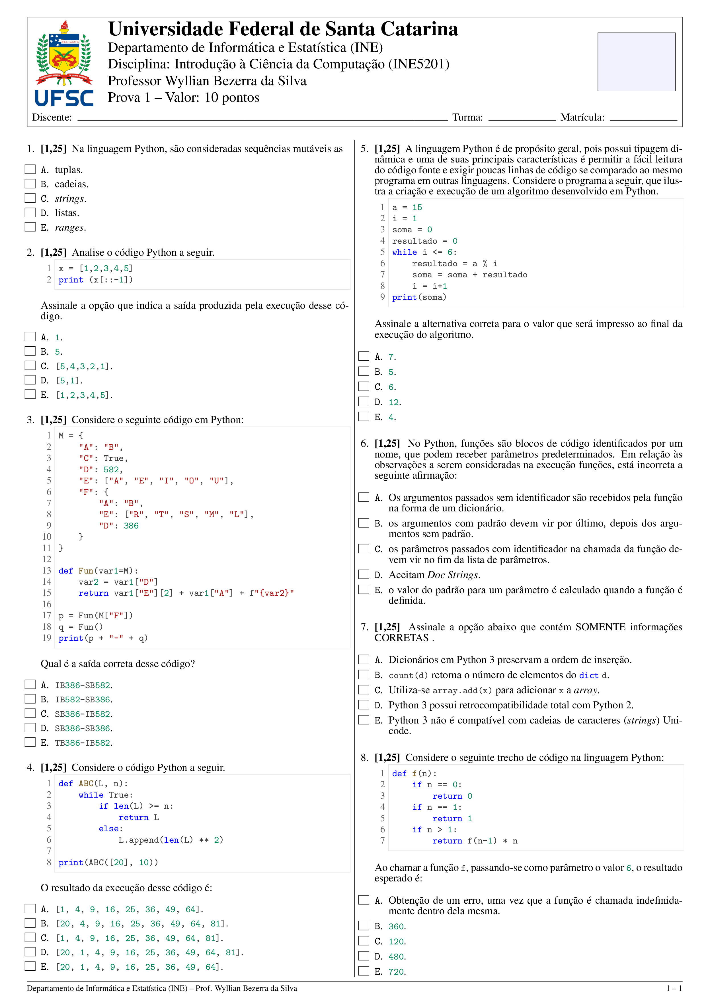
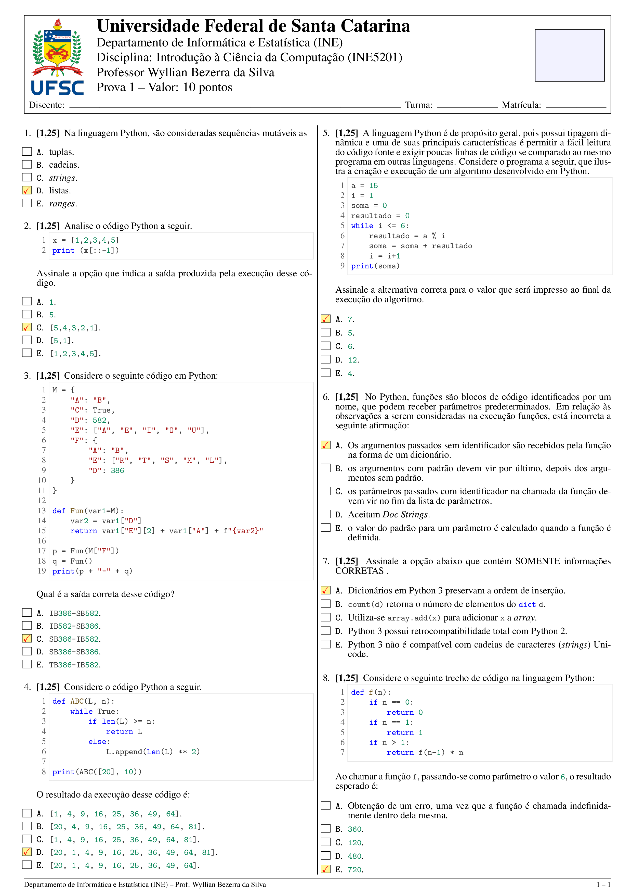

# 🎲 Randomizador de Questões $\LaTeX$ -- Question Randomizer

Código em Python para randomizar questões de provas em formato $\LaTeX$, com suporte a questões de múltipla escolha e questões de verdadeiro ou falso.


## 📋 Descrição

Este código permite selecionar aleatoriamente questões de um banco de dados (contendo arquivos `.tex`) e gera um arquivo de saída com as questões uniformemente randomizadas. Para questões de múltipla escolha, as alternativas são embaralhadas automaticamente.

O sistema foi projetado para funcionar em conjunto com o Código LaTeX Para Provas Com Gabarito, disponível em [https://github.com/wyllianbs/carderno_prova](https://github.com/wyllianbs/carderno_prova), o qual permite gerar provas formatadas com gabarito.


## ✨ Características

- ✅ **Seleção aleatória** de questões, segundo uma distribuição uniforme.
- ✅ **Randomização automática** das alternativas em questões de múltipla escolha.
- ✅ **Preservação do gabarito** durante a randomização.
- ✅ **Suporte a questões V ou F** (verdadeiro/falso).
- ✅ **Validação de entrada** do usuário.
- ✅ **Arquitetura POO** (Orientação a Objetos).
- ✅ **Não modifica** os arquivos originais (apenas os lê).


## 📁 Estrutura do Projeto

```
.
├── question_randomizer.py     # Script principal
├── db/                        # Diretório com banco de questões (.tex)
│   ├── P1
│   │   ├── P1_mutability.tex
│   │   ├── P1_Python3.tex
│   │   └── P1_while.tex
│   └── P2
│       ├── P2_arrays_dict.tex
│       ├── P2_arrays_general.tex
│       ├── ... 
│       └── P2_strings.tex
├── samples/                   # Exemplos de saída
│   ├── caderno_prova.pdf
│   └── caderno_prova_gabarito.pdf
├── figs/                      # Imagens para documentação
│   ├── caderno_prova.png
│   └── caderno_prova_gabarito.png
├── questions.tex              # Arquivo de saída (gerado)
├── LICENSE                    # Licença GPL-3.0
└── README.md                  # Este arquivo
```


## 🚀 Instalação

### Requisitos

- **Python 3.6+**
- **Linux** (testado no SO Linux, distro Debian Trixie).
- Bibliotecas padrão Python (não requer instalação de pacotes externos).

### Clone o repositório

```bash
git clone https://github.com/wyllianbs/question-randomizer.git
cd question-randomizer
```


## 📖 Como Usar

### Execução Básica

```bash
python3 question_randomizer.py
```

### Fluxo de Uso

1. **Arquivo de saída**: Digite o nome/caminho do arquivo de saída (default: `questions.tex`).
2. **Diretório de questões**: Digite o diretório contendo os arquivos `.tex` (default: `db/`).
3. **Número de questões**: O sistema mostrará quantas questões estão disponíveis e solicitará quantas deseja selecionar (default: `10`).

### Exemplo de Execução

```
============================================================
RANDOMIZADOR DE QUESTÕES LaTeX
============================================================

Nome/path do arquivo de saída [default: questions.tex]: 
Diretório contendo as questões [default: ./db]: 

------------------------------------------------------------
📚 Carregando questões...

📂 Buscando em: /media/data/Work/UFSC/Atividades/Pesquisa/Coding/Random_Questions/db

  ✓ P1/P1_Python3.tex                        - 1 questão
  ✓ P1/P1_mutability.tex                     - 1 questão
  ✓ P1/P1_while.tex                          - 1 questão
  ✓ P2/P2_arrays_dict.tex                    - 1 questão
  ✓ P2/P2_arrays_general.tex                 - 1 questão
  ✓ P2/P2_arrays_list.tex                    - 1 questão
  ✓ P2/P2_arrays_tuple.tex                   - 1 questão
  ✓ P2/P2_function_direct_recursion.tex      - 1 questão
  ✓ P2/P2_function_indirect_recursion.tex    - 1 questão
  ✓ P2/P2_function_lambda.tex                - 1 questão
  ✓ P2/P2_functions.tex                      - 1 questão
  ✓ P2/P2_strings.tex                        - 1 questão

💡 Total de questões disponíveis: 12
------------------------------------------------------------

Número total de questões a selecionar [default: 10; disponível: 12]: 8

------------------------------------------------------------
⚙  Configuração:
  Arquivo de saída: questions.tex
  Diretório: db
  Questões a selecionar: 8
------------------------------------------------------------

🔀 Selecionando questões...

📊 Estatísticas:
  Total de arquivos: 12
  Total de questões disponíveis: 12
  Questões a selecionar: 8

⚙  Processando questões (randomizando alternativas)...

✓ Arquivo 'questions.tex' gerado com sucesso!
  Total de questões: 8
```


## 📝 Formato das Questões

### Questão de Múltipla Escolha

```latex
\needspace{10\baselineskip}
\item \rtask \ponto{\pt} Texto da questão...

\begin{answerlist}[label={\texttt{\Alph*}.},leftmargin=*]
    \ti Alternativa incorreta 1.
    \ti Alternativa incorreta 2.
    \di Alternativa correta (gabarito).
    \ti Alternativa incorreta 3.
    \ti Alternativa incorreta 4.
\end{answerlist}
```

### Questão Verdadeiro/Falso

```latex
\needspace{9\baselineskip}
\item \rtask \ponto{\pt} Texto da questão...

{\setlength{\columnsep}{0pt}\renewcommand{\columnseprule}{0pt}
\begin{multicols}{2}
\begin{answerlist}[label={\texttt{\Alph*}.},leftmargin=*]
    \ifnum\gabarito=1\doneitem[V.]\else\ti[V.]\fi % gabarito
    \ti[F.]
\end{answerlist}
\end{multicols}
}
```


## 🎯 Distribuição Uniforme

O algoritmo de seleção implementa uma **distribuição uniforme inteligente**:

- **Se `num_questões ≤ num_arquivos`**: Seleciona no máximo 1 questão por arquivo, garantindo diversidade de questões aleatoriamente escolhidas.
- **Se `num_questões > num_arquivos`**: Distribui proporcionalmente baseado no número de questões de cada arquivo.


## 🏗️ Arquitetura (POO)

O projeto utiliza Programação Orientada a Objetos com as seguintes classes:

| Classe | Responsabilidade |
|--------|------------------|
| `Question` | Representa uma questão individual e sua randomização |
| `QuestionFile` | Gerencia um arquivo `.tex` e suas questões |
| `QuestionDatabase` | Gerencia o banco de dados completo (diretório) |
| `OutputWriter` | Escreve o arquivo de saída |
| `UserInterface` | Interface com o usuário (entrada/saída) |
| `QuestionRandomizer` | Classe principal (Facade) que coordena todo o processo |


## 📊 Exemplos

### Prova Gerada
- [PDF da Prova](samples/caderno_prova.pdf)



### Gabarito
- [PDF do Gabarito](samples/caderno_prova_gabarito.pdf)



> **Nota**: Os PDFs acima foram gerados usando o Código LaTeX Para Provas Com Gabarito, disponível em [https://github.com/wyllianbs/carderno_prova](https://github.com/wyllianbs/carderno_prova) com o arquivo `questions.tex` produzido pelo `question_randomizer.py`.


## 🔧 Integração com $\LaTeX$ 

Para compilar o arquivo gerado e criar a prova final:

1. Clone o repositório do _template_:
```bash
git clone https://github.com/wyllianbs/caderno_prova.git
```

2. Copie o arquivo `questions.tex` gerado pelo `question_randomizer.py` para o diretório do _template_ e o inclua no arquivo principal (_e.g._, `\input{questions.tex}` no arquivo `main.tex`) de compilação TeX.

3. Compile com `pdflatex` ou `xelatex`:
```bash
pdflatex main.tex
```


## 🐛 Tratamento de Erros

O programa valida:
- ✅ Existência do diretório especificado.
- ✅ Disponibilidade de questões.
- ✅ Número de questões solicitado vs. disponível.
- ✅ Entrada numérica válida.


## 📜 Licença

Este projeto está licenciado sob a Licença [GNU General Public License v3.0](LICENSE).


## 👤 Autor

Prof. Wyllian Bezerra da Silva
Universidade Federal de Santa Catarina (UFSC)
Departamento de Informática e Estatística (INE)

---

**Nota**: Este projeto foi desenvolvido especificamente para uso na UFSC, mas pode ser facilmente adaptado para outras instituições de ensino.
